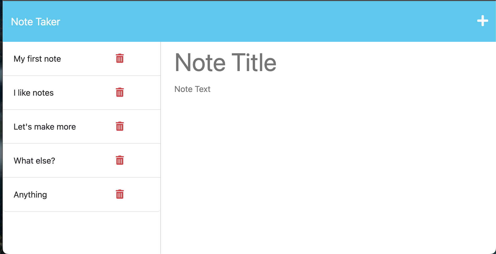

# Note Taker

## Description
This note taker allows user the save and retrieve their most important notes! The data is stored in a database so the list will stick around. The UI allows users to delete old notes.

## Table of Contents
- [Usage](#usage)
- [Credits](#credits)
- [Features](#features)
- [Access](#access)

## Usage
- Click "Get Started" at the landing page
- Use the + to add a new note and use the save icon to save after writing
- Reopen old notes by clicking note in left pane
- Delete note by clicking the trash can icon

## Credits
The backend was built by me and the front-end came from [starter code](https://github.com/coding-boot-camp/miniature-eureka).

## Features
- Add, Store, Delete your favorite notes
- No frill note taker
- Use and enjoy!

## Access
Click to view repository: [Note Taker](https://github.com/johnpow/note-taker).

Deployed Site: [Note Taker](https://vast-inlet-18412.herokuapp.com/).
